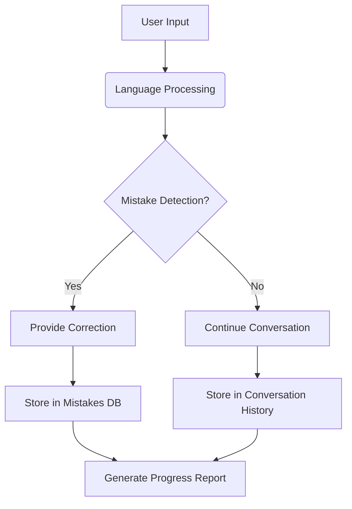

# 🌍 Language Learning Chatbot with Indian and Foriegn Languages

## 🚀 Features

- **Multi-language Support**: Learn Hindi, Bengali, Tamil, Telugu and 10+ other languages
- **Mistake Tracking**: Automatic detection and categorization of errors
- **Vocabulary Builder**: Stores new words with translations and examples
- **Progressive Learning**: Adapts to different proficiency levels (A1-C2)
- **Cultural Context**: Scenario-based learning (markets, festivals, travel, etc.)

## 🖥️ Live Demo

[Try the Live Demo Here](https://huggingface.co/spaces/Ashgen12/Language_Expert) 

## 🛠️ Installation

1.  Clone the repository:
    ```bash
    git clone https://github.com/Ashgen12/language-learning-chatbot.git
    cd language-learning-chatbot
    ```
2.  Install dependencies:
    ```bash
    pip install -r requirements.txt
    ```
3.  Run the application:
    ```bash
    python chatbot.py
    ```

## 📚 Supported Languages

<div align="center">

| Language |  Example Scenario     |
| :------- | :-------------------  |
| Hindi    |  Market Shopping      |
| Bengali  |  Festival Celebration |
| English  |  Job Interview        |
| Spanish  |  Hotel Check-in       |
| *(...and more)* | *...* | *...*  |

</div>

## 🔍 How It Works


## 📦 Dependencies

-   Python 3.8+
-   Gradio (for UI)
-   LangChain (or similar LLM framework for AI processing)
-   Pandas (for data handling/analysis)
-   Matplotlib (or other library for visualizations)

## 🤝 Contributing

We welcome contributions! Please follow these steps.

Please ensure your code adheres to standard coding practices and includes tests where applicable.

## 📄 License

This project is licensed under the APACHE License - see the [LICENSE](LICENSE) file for details.

<div align="center">
  <p>Made with ❤️ for language learners worldwide</p>
  <p>✨ <em>"The limits of my language mean the limits of my world."</em> - Ludwig Wittgenstein ✨</p>
</div>

---
